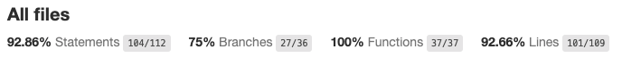
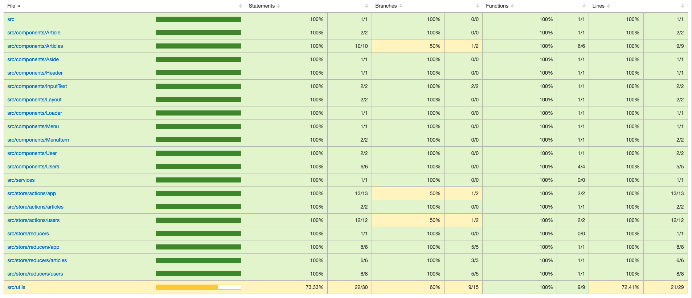

# supermetrics-react-assingment

Project developed following requirements from [Supermetrics](https://github.com/supermetrics-public/react-assignment)

---
## Assignment

Create a post-view app reader using React that provides a login page for the user and a dashboard to display the posts. Using CSS toolkits and UI frameworks (bootstrap etc) is not allowed.

---

## Required features

* [x] Login Screen with email and name inputs.
* [x] Sender list with sender name and post count ordered by name alphabetically.
* [x] Clicking on a sender opens that sender's posts in the post list view.
* [x] Post list where posts are ordered by creation time.
* [x] Post order buttons to allow choosing most recent first and most recent last ordering for posts list

---

## Extra features (in progress)
* [x] Search box for senders
* [x] Searchbox for posts
* [ ] Deep-linkable post list
* [x] Dockerfile and docker-compose
* [x] Deployed [Visit app here](https://lucassenarj.github.io/supermetrics-react-assignment/)
* [x] Github actions tests
* [x] Automated release versions
* [x] Installable on desktop
* [x] Posts available offline
* [ ] End2end tests

---

## Running

- `git clone https://github.com/lucassenarj/supermetrics-react-assignment`
- `cd supermetrics-react-assignment`
- `yarn install` or `npm install`
- `yarn start` or `npm start`

---

## Testing

- `yarn test` or `npm test`

---

## Test coverage

